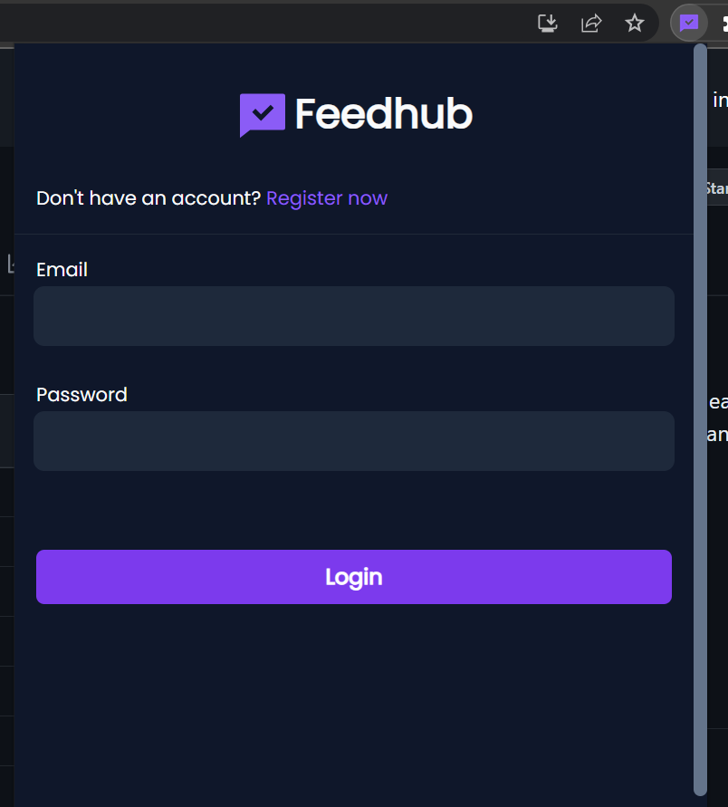
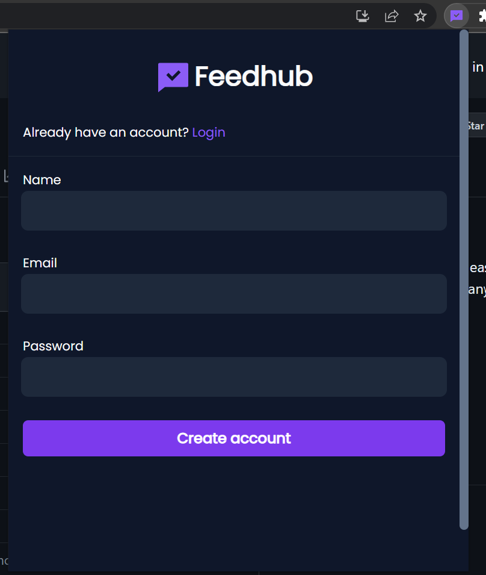
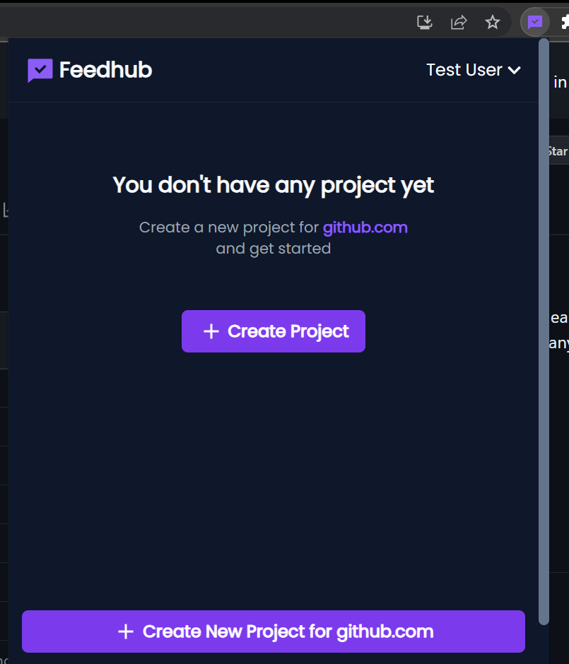
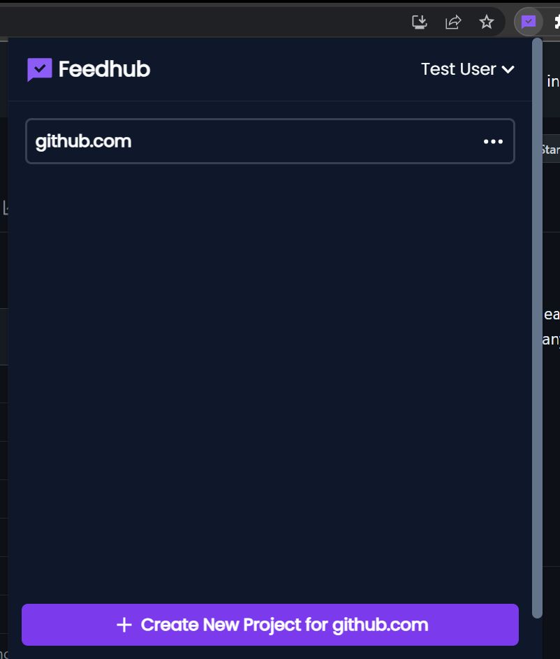
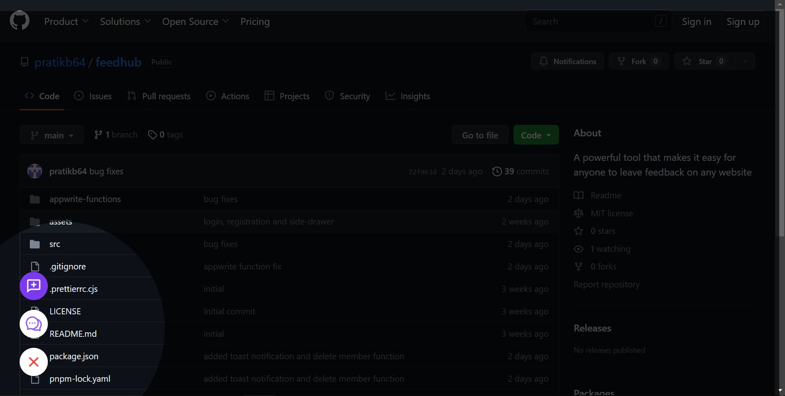

  

  
  

<h1 align="center">Feedhub : Appwrite Hashnode Hackathon Project</h1>

Feedhub is an innovative browser extension designed to enhance collaboration among developers, designers, and stakeholders by facilitating quick feedback sharing on websites. With Feedhub, users can effortlessly share ideas, express thoughts, and ensure everyone stays informed about the latest changes, resulting in increased productivity and efficiency.

## Login page

## Register page

## Home page

This is how the homepage will look like when you don't have any projects. You can start by creating your own or simply ask the project owner to invite you to their project.

## Dashboard

Here you will find all the projects that you are associated with, including your own and the ones that you are invited to.

## Project page

The Project page will show all the comments on your project

## Project settings

This is you show the information about the current project

## Invite member

From here you can invite people to your project to collaborate with them, but just keep in mind that they need to be registered on Feedhub

## Toolbar

These three buttons will help you write comments, open the side drawer and close the currently active project.

## Add Comment

After you click on "Add comment" whether from the toolbar or extension popup element selector will be activated and upon selecting an element on the page this little popup will show up where you can write your desired comment.

## Side Drawer

This is just for convenience as it is the same as the "Project page" from the popup.

## Supported Browsers

- Chrome
- Edge (Not tested but Plasmo framework can build for it.)
- Should support all Chromium based browsers (Not tested but Plasmo framework can build for it.)
- Firefox (Not tested but Plasmo framework can build for it.)
